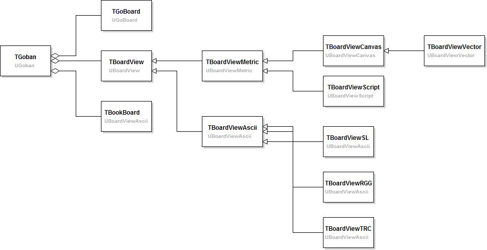
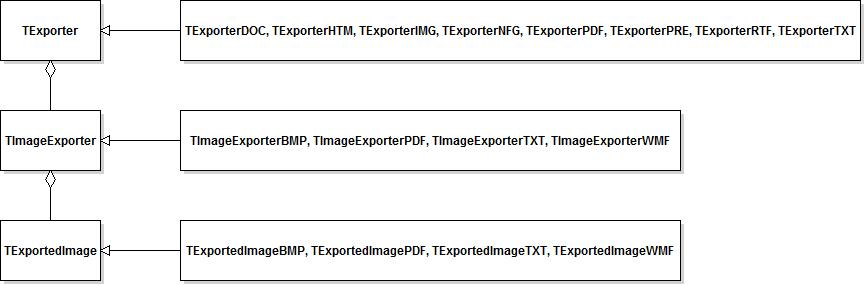

[TOC]

------

# Big picture

## Go board implementation

------

__TGoban__

Full class with logic and display capabilities.

__TGoBoard__

Only logic: position, capture, ko, etc.

__TBoardView__

How the board is displayed, subclassed for display in graphic or text form.

__TBoardViewMetric__

Graphic display as pdf or bitmaps.

__TBoardViewAscii__

Board display in text format, subclassed into __TBoardViewSL__, **TBoardViewRGG** and **TBoardViewTRC** respectively to export to Sensei Library diagram format, rec.games.go diagram format and to the format used for Drago testing.

__TBoardViewCanvas__

Board display in graphic format (bitmap, WMF).

__TBoardViewVector__

Board display in WMF format.

__TBoardViewScript__

Export the board as a list of text commands to be used when exporting to PDF (see UImageExporterPDF).

__TBookBoard__

In charge, of exporting a position as in books, i.e. prisoners are not removed and following moves are indicated with the number of the captured stone (e.g. move 56 at 34).

------

## Printing and exporting

TExporter classes are used by the print form and the print module to export or preview games. 

The print form (fmPrint) enables the user to specify the action (preview, print or export) and set the parameters. Action and formats are instantiated into the relevant TExporter and TExporterImage.

The procedure DoPreviewGame (legacy name) goes through a game and launches the export of comments, figures and variations according to the parameters set by the user. When an export action is required, the procedure used the current exporter.

TExporter copes with full games.

TExporterImage concerns only board images making TExportedImage to be used by TExporter.

__TExporterPRE__

Exports to a canvas to be displayed in the preview window.

__TExporterDOC, TExporterHTM, TExporterPDF, ExporterRTF, TExporterTXT__

Are respectively used to export to MsWord, Html, Pdf, Rtf and text format.

__TExporterIMG__

Exports only the figures.

__TExporterNFG__

Only counts the number of figures.

__TImageExporterBMP__

Exports figures to BMP format which are finally saved into the various graphic formats (JPG, PNG, GIF and BMP).

__TImageExporterPDF__

Exports figures into a list of text comments to be interpreted and inserted in PDF files.

__TImageExporterTXT, TImageExporterWMF__

Exports figures into TXT format, or to WMF format (to be inserted in RTF files).